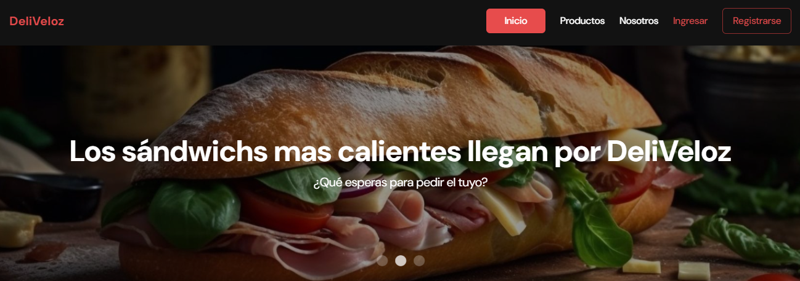

> # DeliVeloz API
---


Esta es una **API** sencilla usada en un proyecto grupal realizado en el **Bootcamp** ***Henry***, esta API fue realizada con el objetivo de cubrir la necesidad de optimizar el inicio del servidor local (ya que se usaba la dependencia **JSON-Server**), y del deploy de la parte de Back en **Render**. 

El tiempo de deploy e inicio de servidor fueron optimizados correctamente, lo cual fue un gran implementación.

---
Para poder usar la api de forma local tendremos que ejecutar el comando:
```
npm start
```
(Considerando que anteriormente ya se ha descargado el respositorio e instalado dependencias con **npm install o npm i**)

---
La **API** al ser sencilla solo cuenta con tres endpoint disponibles, dado que el servidor está configurado para correr en el puerto *3001*:

| EndPoint | Función |
|------------|-----------|
| http://localhost:3001/products | Retorna un array de objetos con la información de todos los productos  |
| http://localhost:3001/category | Retorna un array de objetos que contiene un nombre de la categoria general, y una propiedad *subcategories* que es un array de subcategorias de cada categoria general |
| http://localhost:3001/banner | Retorna un array de objetos que contienen informacion de un producto: título, descripción, imagen. |

---

Por ahora, esa es toda la información que puedo dar acerca de esta API, Espero que si en algun momento es utilizado en algun proyecto, sea de su agrado y funcione correctamente

***LAXWIP***